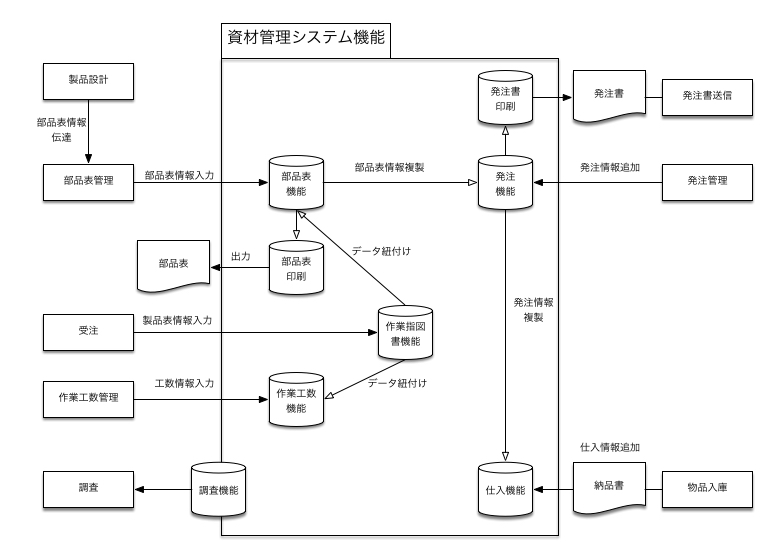
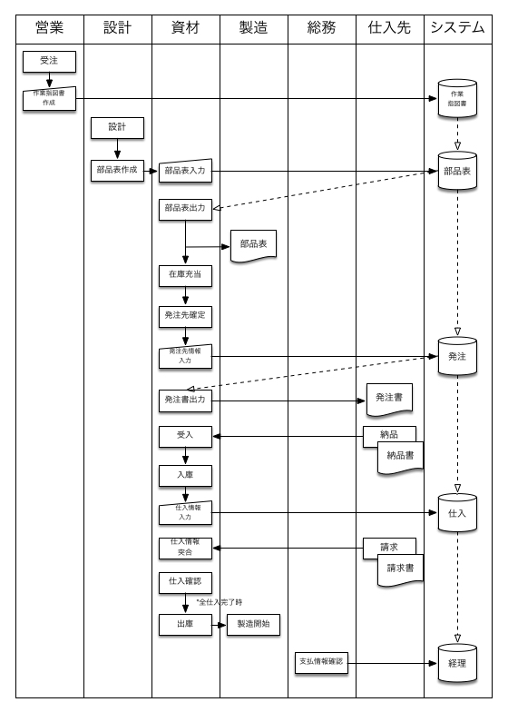
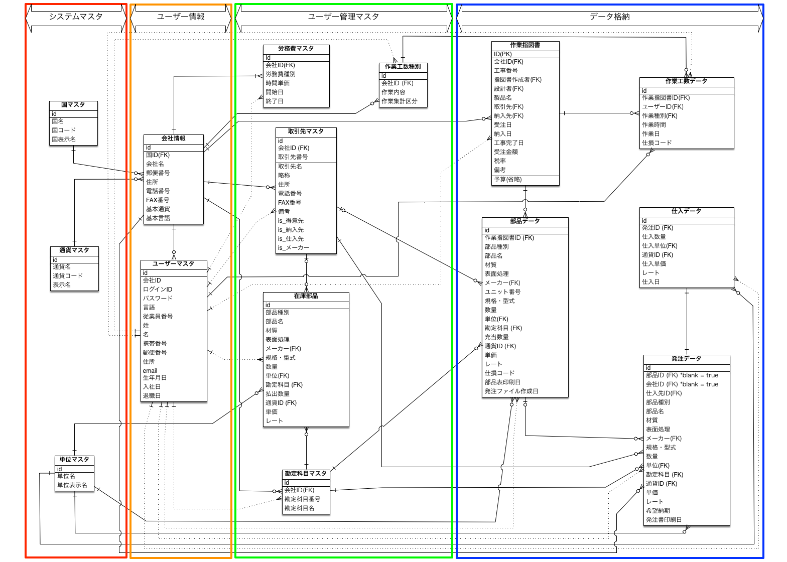

# 要件定義

## 目次

- システム構成概要

- 業務分析
  - 資材管理等業務分析概念図
  - 資材発注業務フロー

- 運用環境

- 機能要件
  - 機能リスト
    - 本体API機能リスト
    - 共通機能リスト
  - 機能詳細
    - 本体API機能
    - 共通機能詳細
  - データベース構成

## システム構成概要

本システムは個別受注生産型の機械製造業にて、個別原価計算及び資材管理を目的として作成する。

海外複数拠点での利用を想定しており、複数通貨・言語の対応を行う予定である。

また、導入時は拠点ごとのローカル環境での運用を行うが、将来的には全社を統合した環境での運用を目指す。

なお、ユーザー管理については会社毎にアカウントを作成し、ユーザーはその下に紐づく形式でIDを発行する。

## 業務分析

使用想定企業での実際の業務の流れの分析にによる概念図、業務フローを記述する。

### 資材管理等業務分析概念図

実際に発生する業務及び必要情報とシステムで集計、管理する情報の概念図を記載する。

### 資材発注業務フロー

上記下概念図を元に、製品の受注から資材発注、仕入、支払いまでの期間業務フローを記載する。

実際の業務としては部品データの複写登録等必要なフロー、機能が存在するが、システム本体の基幹機能の理解のために簡易な業務フローを作成している。

## 運用環境

- 本システムは各拠点ごとのローカルサーバーに設置する
- Dockerを使用して統一仮想環境で運用を行う
- システム構成
    - Django REST framework上で駆動するバックエンドREST API
    - Vue.jsで作成したブラウザ駆動のフロントエンド
    
## 機能要件

### 機能リスト

#### 本体外部機能リスト

外部機能の一覧リストを記載する。

No  |ID  |レベル |機能名  |機能種別 |機能概要 |
---|---|---|---|---|---|
1  | F001     | 1   | 作業指図書     |      |
2  | F001-1   | 2   | 一覧表示      | GET  | ソート、ページネーション、検索含む
3  | F001-2   | 2   | 新規登録      | POST |
4  | F001-3   | 2   | 詳細表示      | GET  |
5  | F001-4   | 2   | 編集        | PUT  | 工事完了情報の編集含む
6  | F001-5   | 2   | 工事完了      | PUT  | 工事完了入力のみ
7  | F001-6   | 2   | 運送依頼      |      |
8  | F001-6-1 | 3   | 運送依頼登録    | POST | 別テーブルに作成
9  | F001-6-2 | 3   | 運送依頼編集    | PUT  |
10 | F001-6-3 | 3   | 発送依頼再発行   | GET  | 印刷のみ
11 | F001-7   | 2   | 納品書発行     |      |
12 | F001-7-1 | 3   | 納品書発行     | POST | 別テーブルに作成
13 | F001-7-2 | 3   | 納品書編集     | PUT  |
14 | F001-7-3 | 3   | 納品書再発行    | GET  | 印刷のみ
15 | F001-8   | 2   | 売上計上日登録   | PUT  | 売上計上日入力のみ
16 | F002     | 1   | 部品表       |      |
17 | F002-1   | 2   | 一覧表示      | GET  | ソート、ページネーション、検索含む
18 | F002-2   | 2   | 新規登録      | POST |
19 | F002-3   | 2   | 詳細表示      | GET  |
20 | F002-4   | 2   | 編集        | PUT  | フラグ立ち済みのの際の判別機能必須
21 | F002-5   | 2   | 部品表印刷     | PUT  | 印刷及びフラグ処理
22 | F002-6   | 2   | 部品表再印刷    | GET  | 印刷のみ、選択印刷機能込み
23 | F002-7   | 2   | 部品一括登録    | POST | 複写登録、Excelアップロード用
24 | F003     | 1   | 発注        |      |
25 | F003-1   | 2   | 一覧表示      | GET  | ソート、ページネーション、検索含む
26 | F003-2   | 2   | 一括新規登録    | POST | 部品表からの転記作成用
27 | F003-3   | 2   | 新規登録      | POST | 工番なし、在庫部品用
28 | F003-4   | 2   | 詳細表示      | GET  |
29 | F003-5   | 2   | 編集        | PUT  | フラグ立ち済みのの際の判別機能必須
30 | F003-6   | 2   | 発注書印刷     | PUT  | 印刷及びフラグ処理、仕入ファイル作成
31 | F003-7   | 2   | 発注書再印刷    | GET  | 印刷のみ、選択印刷機能込み
32 | F004     | 1   | 仕入処理      |      |
33 | F004-1   | 2   | 一覧表示      | GET  | ソート、ページネーション、検索、納期経過分含む
34 | F004-2   | 2   | 仮仕入処理     | PUT  | 部品入荷日の登録、フラグ不要
35 | F004-3   | 2   | 仕入処理      | PUT  | 納品書到着基準、フラグ建て、仕入修正も兼用
36 | F005     | 1   | 調査        |      |
37 | F005-1   | 2   | 売上高集計     | GET  | 課税売上、非課税売上、合計の表示区分
38 | F005-2   | 2   | 仕掛材料費集計   | GET  |
39 | F005-3   | 2   | 仕掛労務費集計   | GET  |
40 | F005-4   | 2   | 直接原価実績集計  | GET  |
41 | F005-5   | 2   | 受注残集計     | GET  |
42 | F005-6   | 2   | 従業員別労務費集計 | GET  |
43 | F005-7   | 2   | 仕入先別集計表   | GET  | 明細表も選択表示可能にする
44 | F005-8   | 2   | 作業指図書別集計表 | GET  | 明細表も選択表示可能にする
45 | F006     | 1   | マスタ       |      |
46 | F006-1   | 2   | 会社情報マスタ   |      |
47 | F006-1-1 | 3   | 詳細表示      | GET  | 税率含む
48 | F006-1-2 | 3   | 編集        | PUT  |
49 | F006-2   | 2   | 銀行情報マスタ   |      |
50 | F006-2-1 | 3   | 一覧表示      | GET  |
51 | F006-2-2 | 3   | 新規登録      | POST |
52 | F006-2-3 | 3   | 詳細表示      | GET  |
53 | F006-2-4 | 3   | 編集        | PUT  |
54 | F006-3   | 2   | 取引先マスタ    |      |
55 | F006-3-1 | 3   | 一覧表示      | GET  | ソート、ページネーション、検索含む
56 | F006-3-2 | 3   | 新規登録      | POST |
57 | F006-3-3 | 3   | 詳細表示      | GET  |
58 | F006-3-4 | 3   | 編集        | PUT  |
59 | F006-4   | 2   | メーカーマスタ   |      |
60 | F006-4-1 | 3   | 一覧表示      | GET  | ソート、ページネーション、検索含む
61 | F006-4-2 | 3   | 新規登録      | POST |
62 | F006-4-3 | 3   | 詳細表示      | GET  |
63 | F006-4-4 | 3   | 編集        | PUT  |
64 | F006-5   | 2   | 労務費マスタ    |      |
65 | F006-5-1 | 3   | 一覧表示      | GET  | ソート、ページネーション、検索含む
66 | F006-5-2 | 3   | 新規登録      | POST |
67 | F006-5-3 | 3   | 詳細表示      | GET  |
68 | F006-5-4 | 3   | 編集        | PUT  |
69 | F007     | 1   | 作業工数      |      |
70 | F007-1   | 2   | 一覧表示      | GET  |
71 | F007-2   | 2   | 新規登録      | POST |
72 | F007-3   | 2   | 詳細表示      | GET  |
73 | F007-4   | 2   | 編集        | PUT  |
74 | F008     | 1   | 見積        |      |
75 | F008-1   | 2   | 一覧表示      | GET  |
76 | F008-2   | 2   | 新規登録      | POST | 複写の際にも使用
77 | F008-3   | 2   | 詳細表示      | GET  |
78 | F008-4   | 2   | 編集        | PUT  |
79 | F008-5   | 2   | 見積承認      | PUT  |
80 | F008-6   | 2   | ステータス変更   |      | 受注、失注、ペンディング等
81 | F009     | 1   | バッチ処理関係   |      |
82 | F009-1   | 2   | 製造原価集計    | PUT  | 部品表合計と集計の差異確認、週次程度
83 | F009-2   | 2   | 基本バックアップ  | GET  | 同一構造DBに定期バックアップを行う
84 | F009-3   | 2   | 物理バックアップ  | 非API | 日時でDBをDumpしてローカル保存する

#### 共通機能リスト

システム内部での共通機能を記述する

|No |ID     |レベル |機能名           |機能種別 |機能概要|
---|---|---|---|---|---|
|85 | C001   | 1     | サーバーサイド機能 |      |     |
|86 | C001-1 | 2     | 入力エラーチェック |      |     |
|87 | C001-2 | 2     | ログ管理          |      |     |
|88 | C001-3 | 2     | 削除機能          |      |     |
|89 | C002   | 1     | クライアントサイド関係機能 |      |     |
|90 | C002-1 | 2     | ページネーション      |      |     |
|91 | C002-2 | 2     | リストの選択及びページ推移 |      |     |
|92 | C002-3 | 2     | ソート機能         |      |     |
|93 | C002-4 | 2     | リストの絞り込み表示    |      |     |
|94 | C003   | 1     | 認証関係          |      |     |
|95 | C003-1 | 2     | ログイン認証        |      |     |
|96 | C003-2 | 2     | パスワード管理       |      |     |
|97 | C005   | 1     | 多言語対応         |      |     |
|98 | C006   | 1     | マルチカレンシー      |     |

### 機能詳細

#### 本体外部機能

[外部設計書](external_design_backend.md)を参照のこと

#### 共通機能詳細

- C001-1 入力エラーチェック

  - エラーチェックについては基本的に本体API側で確認処理を行う。
  - エラーチェックの項目で共通するものについてはDRYを意識し、 共通クラスから参照を行うように注意する。
  - コーディング前の設計時点でAPIの入出力規定を定める

- C001-2 ログ管理機能

  - 登録、修正等レコードの変更を伴う処理についてはログを取得し、 いつ、誰が、どのデータを触ったのかについて確認できるようにする

- C001-3 削除機能

  - データの削除については基本的に物理削除とする。 基本的にユーザー権限で削除可能ユーザーを絞り込む

- C002-1 ページネーション

  - 基本的にDjango REST APIの機能を使用する。

- C002-2 リストの選択及びページ推移

  - 本システムでは多くの場面でリスト表示→選択という流れを取る。
  - その為統一関数を作成し、DRYを意識する。
  - なお、本機能はクライアントサイドにて実装する。

- C002-3 ソート機能、C002-4 リストの絞り込み表示

  - リストのソート、絞り込みに関しては、本体API側でリスト表示を行うAPIに組み込んでおく。
  - 独自関数は作らず、あくまでAPIにデータを渡す時点でソート等情報を認識できるようにしておく。
  - APIではリスト表示機能に組み込み、検索機能はクライアントサイドでの機能実装とする。

- C003-1 ログイン認証

  - ログイン認証についてはDjango REST Frameworkにて実装する。
  - その際にAPIごとの権限設定についても行い、アクセス権ベースで機能制限をする。

- C005 多言語対応

  - 保有データに関しては多言語対応が難しい為、基本的には単一言語での処理とする。
  - ただし、集計用項目名などUIに直接表示する文字列はデータベース設計時に多言語レコードを持つようにする。
  - UI等の多言語対応はクライアントサイドで行う。

- C006 マルチカレンシー

  - 基本的に書くデータには通貨入力項目を一つのみとし、
  - 入力通貨と基準通貨への為替レートを保有するようにする。
  
通貨  | 金額      |    レート
|---|---|---|
JPY | 100     |      1
USD | 1       |    105
IDR | 100,000 | 0.0085

上記例では基準通貨をJPYにしているが、拠点マスタに基準通貨を記載し、それに基づいた換算を行う。 なお、基準通貨については初期設定時に選択し、途中変更はしないものとする。

同時に使用通貨マスタも作成し、選択可能にする。 可能であれば入力時レートをスクレイビングで自動取得→表示、手動変更可とする。 その際は元からシステム対応通貨のマスタリストとスクレイビングスクリプトを作成し、 管理画面にて対応通貨の中から使用するもののみを選択可能とする。

- 頭出し検索(インクリメンタルサーチ)

  - 検索用APIEPは作成するが、表示、選択機能についてはクライアントサイドで実装する。
  - 開発優先順位は低いが、頭出しで選択できることにより入力ミスの防止につながる。
  - 同一型番であれば予測変換も可能であり、入力ミスが減ることで統計情報の取得制度が上昇する。
  - 今後資材購入の統計分析を視野に入れているので、順番は遅くなっても確実に実装するようにする。
  
  
  
### データベース構成

#### ER図

#### システムマスタ

ER図上のシステムマスタ項目についてはシステム内で共通のデータを格納する。 国コードや通貨コードなどユーザーに限らず共通して参照する。

#### ユーザー情報

ユーザー企業毎に企業アカウントを作成し、ログインユーザー含む全ての情報はこれに紐づけられる。

#### ユーザー管理マスタ

ユーザー企業毎に保持するマスタ情報部分。 取引先情報や労務費のマスタなど。

#### データ格納

実際の資材管理や原価計算に使用するすのデータを格納する部分。

基本的にアプリケーションで要するデータはここに集約される。